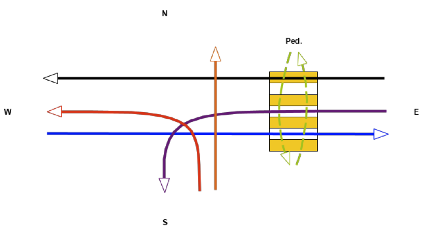

# Traffic Light Controller Promela (SPIN) Model Checking

## Traffic light controller configuration
 

## Files
- [`variant_6.pml`](variant_6.pml) - SPIN model of traffic light controller
- [`architecture.md`](architecture.md) - architecture description of the model
- [`verification.md`](verification.md) - model verification with LTLs
- [`animate.py`](animate.py) - animation of the model